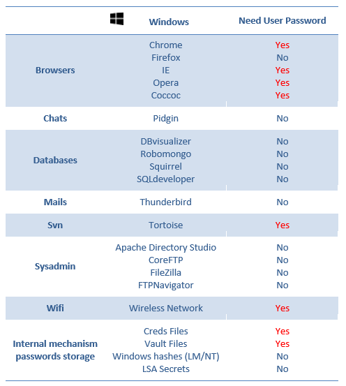

__The LaZagne Project !!!__ 
==

Description
----
The __LaZagne project__ is back !!! 

[LaZagne](https://github.com/AlessandroZ/LaZagne) uses an internal Windows API called *CryptUnprotectData* to decrypt user passwords. This API should be called on the victim user session, otherwise, it does not work. If the computer has not been started (when the analysis is realized on an offline mounted disk), or if we do not want to drop a binary on the remote host, no passwords can be retrieved. 

[LaZagneForensic](https://github.com/AlessandroZ/LaZagneForensic) has been created to avoid this problem. This work has been mainly inspired by the awesome work done by *Jean-Michel Picod* for [DPAPICK](https://bitbucket.org/jmichel/dpapick) and *Francesco Picasso* for [Windows DPAPI laboratory](https://github.com/dfirfpi/dpapilab). 

__Note__: The main problem is that to decrypt these passwords, the user Windows passwords is needed. 

Installation
----
```
pip install -r requirements.txt
```

Usage
----

### First way - Dump configuration files from the remote host
* Using the powershell [script](https://github.com/AlessandroZ/LaZagneForensic/blob/master/dump/dump.ps1)
```
PS C:\Users\test\Desktop> Import-Module .\dump.ps1
PS C:\Users\test\Desktop> Dump
File dump created successfully !
```
* Using the python [script](https://github.com/AlessandroZ/LaZagneForensic/blob/master/dump/dump.py)
```
python dump.py
```
* Launch Lazagne with password if you have it
```
python laZagneForensic.py all -remote /tmp/dump -password 'ZapataVive'
```
* Launch Lazagne without password 
```
python laZagneForensic.py all -remote /tmp/dump
```

### Second way - Mount a disk on your filesystem
* The file should be mounted on your filesystem
```
test:~$ ls /tmp/disk/
total 769M
drwxr-xr-x 2 root root    0 févr.  1 14:05 ProgramData
-rwxr-xr-x 1 root root 256M févr.  1 14:05 swapfile.sys
-rwxr-xr-x 1 root root 512M févr.  1 14:05 pagefile.sys
drwxr-xr-x 2 root root    0 janv. 31 00:35 System Volume Information
dr-xr-xr-x 2 root root    0 janv. 26 10:17 Program Files (x86)
dr-xr-xr-x 2 root root    0 janv. 25 18:13 Program Files
drwxr-xr-x 2 root root    0 janv. 19 10:09 Windows
drwxr-xr-x 2 root root    0 janv. 16 15:52 Homeware
drwxr-xr-x 2 root root    0 janv.  9 17:33 PerfLogs
drwxr-xr-x 2 root root    0 nov.  22 20:37 Recovery
drwxr-xr-x 2 root root 4,0K nov.  22 20:31 Documents and Settings
dr-xr-xr-x 2 root root    0 nov.  22 20:31 Users
```
* Launch Lazagne with password if you have it
```
python laZagneForensic.py all -local /tmp/disk -password 'ZapataVive'
```
* Launch Lazagne without password 
```
python laZagneForensic.py all -local /tmp/disk
```
__Note__: Use __-v__ for verbose mode and __-vv__ for debug mode.

Supported software
----
__Note__: Check the following image to understand which passwords you could decrypt without needed the user windows password. All credentials found will be tested as Windows password in case of the user re-uses the same password. 

<p align="center"></p>

Donation
----
Do not hesitate to support my work doing a donation, I will appreciate a lot:
* Via BTC: 16zJ9wTXU4f1qfMLiWvdY3woUHtEBxyriu

Special thanks
----
* Jean-Michel Picod for [DPAPICK](https://bitbucket.org/jmichel/dpapick)
* Francesco Picasso for [Windows DPAPI laboratory](https://github.com/dfirfpi/dpapilab)
* Jean-Christophe Delaunay - Jiss/Fist0urs from the Synacktiv team for their [work](https://www.synacktiv.com/ressources/univershell_2017_dpapi.pdf)

Recommended articles related to DPAPI
----
* [Happy DPAPI!](http://blog.digital-forensics.it/2015/01/happy-dpapi.html)
* [ReVaulting! Decryption and opportunities](https://www.slideshare.net/realitynet/revaulting-decryption-and-opportunities)
* [Windows ReVaulting](http://blog.digital-forensics.it/2016/01/windows-revaulting.html)
* [DPAPI exploitation during pentest and password cracking](https://www.synacktiv.com/ressources/univershell_2017_dpapi.pdf)

----
| __Alessandro ZANNI__    |
| ------------- |
| __zanni.alessandro@gmail.com__  |

